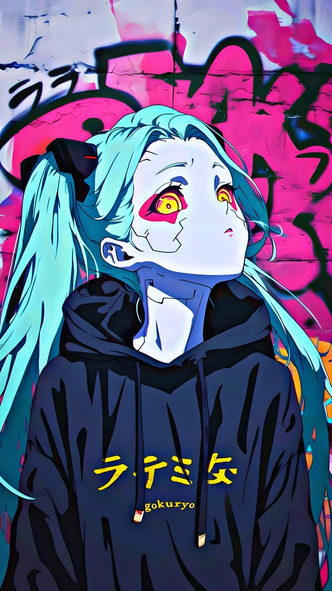
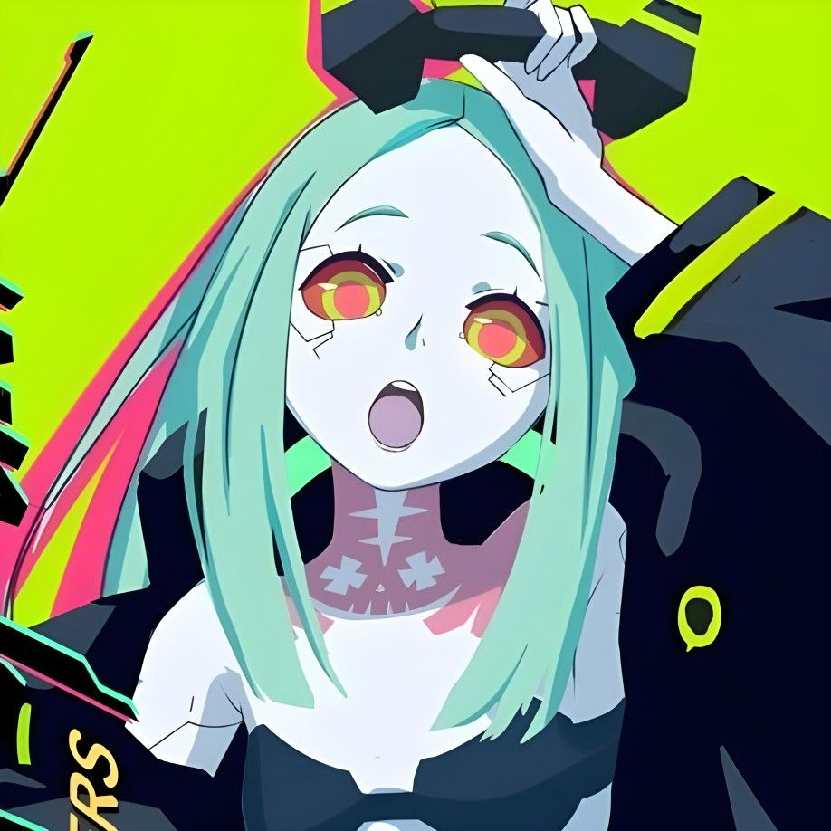
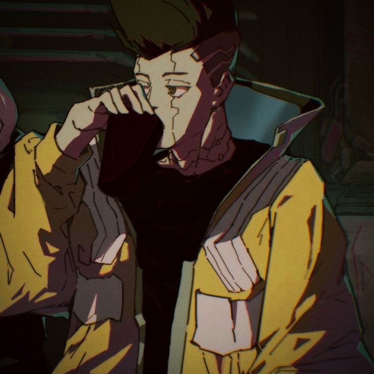
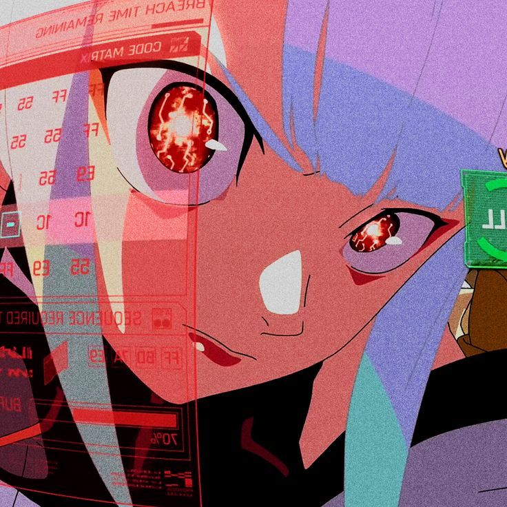

<h2> Hey there! </h2>

### A little bit about me...

💻 I'm Anson, a Computer Engineering student @ UBC 
 
🇭🇰 I was born in Hong Kong, but was raised in Australia for 15 years 
 
🎾 I love playing racket sports such as badminton, tennis, table tennis, and even pickleball 
 
🐧 Penguins are my favorite animals **(noot noot)**

### Currently...
- A software engineering intern @ ScalePad
- Rewatching "*Cyberpunk: Edgerunners*" because it's genuinely so good 🦾 
- Reading "*The Tunnel to Summer, the Exit of Goodbyes*" by Mei Hachimoku ⏳

### Previously...
- Worked on **RAG optimization** at the University of South Australia (now Adelaide University)
- Scaled **backend infrastructure** at Borrow'd

### In The Future...
- Be a TA for math or computer science courses 
- Travel to New York 

### Find Me Here...
- LinkedIn: [in/ansonnchan](https://www.linkedin.com/in/ansonnchan/)
- Personal Portfolio: www.ansonnchan.dev
- Email: ac1800@student.ubc.ca

###

  
<b>⚡ Click here for Cyberpunk: EdgeRunners pictures! ⚡</b>

   
 <table>
  <tr>
    <td align="center"></td>
    <td align="center"></td>
    <td align="center"></td>
  </tr>
  <tr>
    <td align="center"></td>
    <td align="center"></td>
    <td align="center"></td>
  </tr>
  <tr>
    <td align="center"></td>
    <td align="center"></td>
    <td align="center"></td>
  </tr>
</table>

