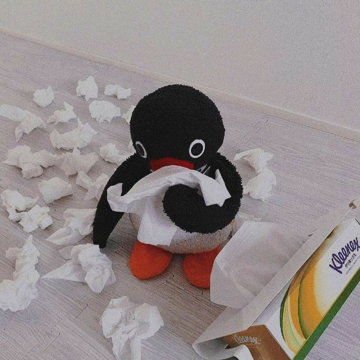
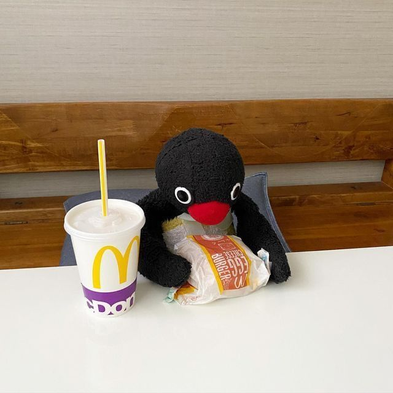

<h2> Hey there! </h2>

### A little bit about me...

💻 I'm Anson, a Computer Engineering student @ UBC 
 
🇭🇰 I was born in Hong Kong, but was raised in Australia for 15 years 
 
🎾 I love playing racket sports such as badminton, tennis, table tennis, and even pickleball 
 
🐧 Penguins are my favorite animals **(noot noot)**

### Currently...
- A software engineering intern @ ScalePad
- On Episode 294 of Detective Conan 🎀 
- Reading "*The Tunnel to Summer, the Exit of Goodbyes*" by Mei Hachimoku ⏳

### Previously...
- Worked on **RAG optimization** at the University of South Australia (now Adelaide University)
- Scaled **backend infrastructure** at Borrow'd
- A **folding demon** @ GAP and teaching children **valuable life lessons** @ Kumon (totally not trauma)

### In The Future...
- Incoming SWE @ Atria Winter 2027
- Be a TA for math or computer science courses 
- Visit NY & SF
- Finish my many roadmaps - System Design, Design Patterns, Software Engineering, AI Engineering and many more 
- Join a design team @ UBC

### Projects...
- [Personal Portfolio](https://ansonnchan.dev), my personal website 🏠
- [Pear Programming](https://pear-programming.vercel.app/), a collaborative code editor (think Google Docs but for programming) 🍐
- [Jukebox](https://my-jukebox-web.vercel.app/), an AI-powered venting platform for you to crash out (we support multiple personalities) 😔
- [Dead Code Explorer](https://github.com/ansonnchan/dead-code-explorer), a VS Code extension that helps you identify dead code from your project ☠️

### Find Me Here...
- LinkedIn: [in/ansonnchan](https://www.linkedin.com/in/ansonnchan/)
- Personal Portfolio: www.ansonnchan.dev
- Email: ananryry180@gmail.com

###

  
<b>🐧 Click here for Pingu pictures!</b>

   
  <table>
    <tr>
      <td align="center"></td>
      <td align="center"></td>
      <td align="center"></td>
    </tr>
    <tr>
      <td align="center"></td>
      <td align="center"></td>
      <td align="center"></td>
    </tr>
    <tr>
      <td align="center"></td>
      <td align="center"></td>
      <td align="center"></td>
    </tr>
  </table>

